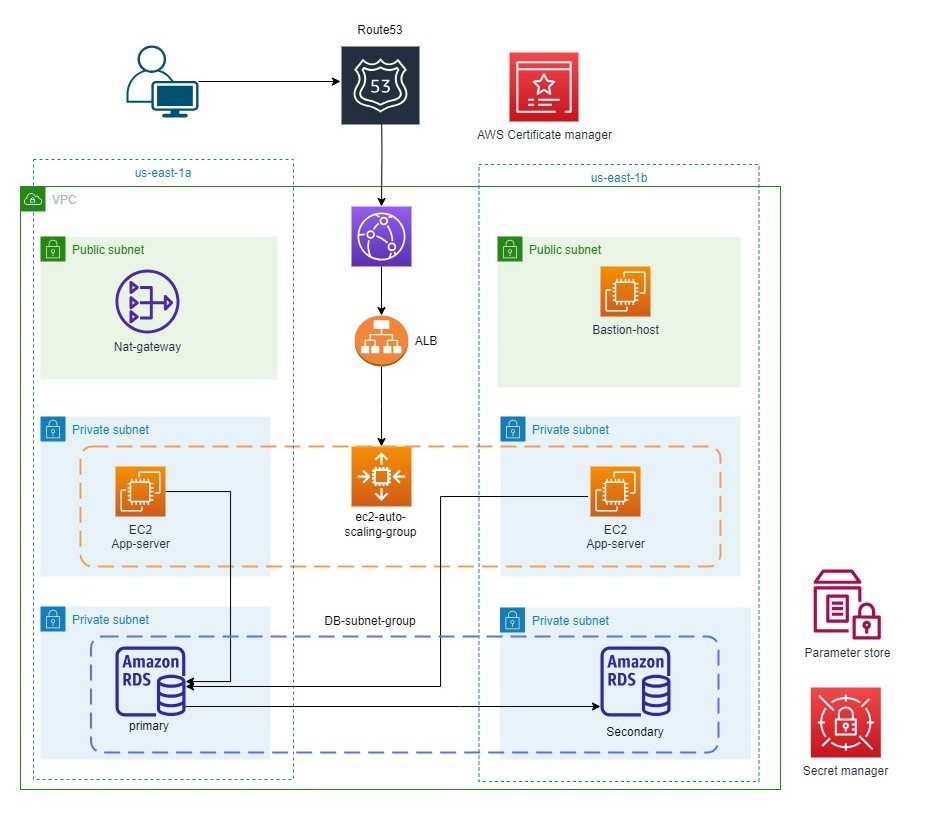

# 3 tier Web Application through terraform


## Prerequisites
- [x] AWS Account
- [x] Proper Permissions for your user
- [X] Terraform installed on your IDE
- [X] AWS CLI installed and configured on your IDE

## Deploy the terraform code

1. **Clone the Github repository.**

    ```bash
    git clone https://github.com/samyywagdy/3tier-web-app.git
    ```
    
1. **Navigate to the `terraform/` directory which contains the Terraform scripts.**

    ```bash
    cd 3tier-web-app/app
    ```

1. **Edit the `backend.tf` file according to your configuration.**

    The `backend.tf` file is used to configure where Terraform stores its state file and locking mechanism. Edit it as follows:
    
    ```HCL
    terraform {
        backend "s3" {
            bucket = "your-s3-bucket-name"
            key    = "terraform.tfstate"
            region = "us-east-1"
            dynamodb_table = "your-DynamoDB-table-name"
        }
    }
    ```

1. **Set up variables for your infrastructure.**
    
    Create a `terraform.tfvars` file to set your variable values. Use the following template as a guide, filling in the appropriate values:

   ```HCL
    PROJECT_NAME     = ""
    VPC_CIDR         = ""
    PUB_SUB_1A_CIDR  = ""
    REGION           = ""
    PUB_SUB_1B_CIDR  = ""
    PRI_SUB_2A_CIDR  = ""
    PRI_SUB_2B_CIDR  = ""
    PRI_SUB_3A_CIDR  = ""
    PRI_SUB_4B_CIDR  = ""
    EC2_TYPE         = ""
    KEY_NAME         = ""
    DB_USERNAME      = ""
    DB_PASSWORD      = ""
    HOSTED_ZONE_NAME = ""
   ```

1. **Initialize Terraform.**

    ```bash
    terraform init
    ```

1. **See what resources will be created.**

    ```bash
    terraform plan -out plan
    ```

1. **Create the resources and deploy the sample.**

    ```bash
    terraform apply plan
    ```

## Clean up

1. **Navigate to the `/app` directory.**

1. **Run the following command:**

   ```bash
   terraform destroy --auto-approve
   ```

   
